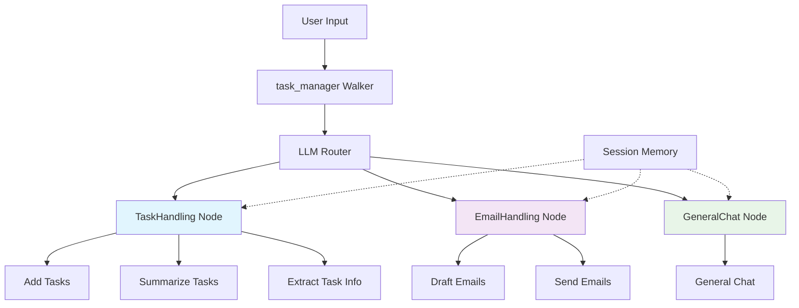

# 🚀 Task Manager Agent

<div align="center">


**An intelligent, agentic task management system powered by Gemini AI**

[](https://jaclang.org/)
[](https://byllm.org/)
[](https://deepmind.google/technologies/gemini/)
[](https://opensource.org/licenses/MIT)

</div>

## 📋 Overview

The **Task Manager Agent** is a sophisticated AI-powered application that demonstrates the power of agentic systems using byLLM (Multi-Tool Prompting) framework. Built with Jac Language, it showcases intelligent task management, email handling, and natural conversation capabilities through specialized AI agents.

### 🎯 Key Features

- 🤖 **Intelligent Task Management** - Natural language task creation and summarization
- 📧 **AI-Powered Email Composition** - Smart email drafting and sending with confirmation
- 💬 **Context-Aware Chat** - General conversation with session memory
- 🔧 **Tool-Based Architecture** - Modular design with specialized agent nodes
- 🧠 **Session Management** - Persistent conversation history and context
- 🎪 **ReAct Pattern** - Reasoning and action framework for LLM decision making

## 🏗 Architecture

<div align="center">



</div>

## 🚀 Quick Start

### Prerequisites

- Python 3.12+
- Gemini API Key
- Gmail account (for email features)

### Installation

1. **Clone and Setup**
```bash
cd ~/Generative-AI-Builds/jac-projects/task_manager
python3.12 -m venv task_manager_env
source jac-env/bin/activate
pip install byllm jac-cloud python-dotenv
```

2. **Environment Configuration**
Add to your `~/.bashrc`:
```bash
export GEMINI_API_KEY="your-gemini-api-key"
export SENDER_EMAIL="your-email@gmail.com"
export SENDER_PASSWORD="your-app-password"
export SENDER_NAME="Your Name"
```
Then reload: `source ~/.bashrc`

3. **Run the Application**
```bash
jac serve main.jac
```

## 🎮 Usage

### API Endpoints

#### Start a New Session
```bash
curl -X POST http://localhost:8000/walker/task_manager \
  -H "Content-Type: application/json" \
  -d '{"utterance": "Add a task to call mom tomorrow at 5pm", "session_id": ""}'
```

#### Get All Sessions
```bash
curl -X POST http://localhost:8000/walker/get_all_sessions \
  -H "Content-Type: application/json" \
  -d '{}'
```

#### Get All Tasks
```bash
curl -X POST http://localhost:8000/walker/get_all_tasks \
  -H "Content-Type: application/json" \
  -d '{}'
```

### Example Interactions

**Task Management:**
```
User: "Schedule a meeting with team tomorrow at 2pm about Q4 planning"
AI: "Task added successfully: Meeting with team about Q4 planning on 2025-10-26 14:00:00"
```

**Email Handling:**
```
User: "Send email to john@company.com about project update"
AI: "I've drafted an email to john@company.com with subject 'Project Update'. Do you want me to send it?"
User: "Yes"
AI: "Email sent successfully!"
```

**Task Summary:**
```
User: "What tasks do I have scheduled?"
AI: "You have 3 tasks:
1. Call mom - 2025-10-25 17:00:00
2. Team meeting - 2025-10-26 14:00:00  
3. Project review - 2025-10-27 10:00:00"
```

## 🏛 Project Structure

```
task_manager/
├── 📄 main.jac              # Main interface definitions
├── 📄 main.impl.jac         # Implementation logic
├── 📄 agent_core.jac        # Core architecture (Memory, Session, Toolbox)
├── 📄 utils.jac             # Utility functions
├── 🔐 .env                  # Environment variables
└── 🐍 jac-env/     # Python virtual environment
```

### Core Components

| Component | Purpose | Key Features |
|-----------|---------|--------------|
| **TaskHandling** | Task management | Add tasks, summarize, extract info |
| **EmailHandling** | Email operations | Draft emails, send with confirmation |
| **GeneralChat** | Conversation | Context-aware responses |
| **Session** | Memory management | Store conversation history |
| **Toolbox** | Base class | Common agent functionality |

## 🔧 Technical Details

### ReAct Pattern Implementation
The system uses the ReAct (Reasoning + Action) pattern:
1. **Reasoning**: LLM analyzes user input and context
2. **Action**: Selects and executes appropriate tools
3. **Observation**: Processes results and continues conversation

### LLM Configuration
```jac
glob llm = Model(model_name="gemini-2.5-flash-preview-05-20", verbose=True);
```

### Tool-Based Architecture
Each node provides specialized tools:
- `TaskHandling`: `add_task`, `summarize_tasks`, `extract_task_info`
- `EmailHandling`: `write_email_content`, `send_email` 
- `GeneralChat`: `chat`

## 🛠 Development

### Adding New Features

1. **Create New Node**: Extend `Toolbox` base class
2. **Define Tools**: Implement specialized functions
3. **Update Routing**: Add to `RoutingNodes` enum
4. **Implement Logic**: Add to `main.impl.jac`

### Example: Adding Reminder Feature
```jac
node ReminderHandling(Toolbox) {
    def set_reminder(task: str, reminder_time: str) -> str;
    def check_pending_reminders() -> list[Reminder];
    def route_and_run(utterance: str, history: str) -> str by llm(
        method="ReAct",
        tools=([self.set_reminder, self.check_pending_reminders])
    );
}
```

## 📊 API Response Format

### Successful Response
```json
{
  "session_id": "urn:uuid:123e4567-e89b-12d3-a456-426614174000",
  "response": "Task added successfully",
  "created_at": "2025-10-25 10:30:45.123456"
}
```

### Session List
```json
[
  {
    "id": "urn:uuid:123e4567-e89b-12d3-a456-426614174000",
    "created_at": "2025-10-25 10:30:45.123456"
  }
]
```

## 🐛 Troubleshooting

### Common Issues

1. **Gemini API Errors**
   - Verify API key is set correctly
   - Check billing and quotas

2. **Email Sending Failures**
   - Use App Password, not regular password
   - Enable 2-factor authentication
   - Check SMTP settings

3. **Import Errors**
   - Ensure all Jac files are in same directory
   - Verify virtual environment is activated

### Debug Mode
Enable verbose logging in `main.jac`:
```jac
glob llm = Model(model_name="gemini-2.5-flash-preview-05-20", verbose=True);
```

## 🤝 Contributing

We welcome contributions! Please see our contributing guidelines for details.

1. Fork the repository
2. Create a feature branch
3. Make your changes
4. Add tests
5. Submit a pull request

## 🧑‍💻 Author

**Cavin Otieno Ouma**

🖥️ *MIS Developer & AI Enthusiast*

 📧 [cavin.otieno012@gmail.com](mailto:cavin.otieno012@gmail.com)
 🔗 [LinkedIn Profile](https://www.linkedin.com/in/cavin-otieno-9a841260/)
 📂 Project Repo: [Task Manager on GitHub](https://github.com/OumaCavin/Generative-AI-Builds/tree/main/jac-projects/task-manager)
 🌐 Main Repository: [Generative-AI-Builds](https://github.com/OumaCavin/Generative-AI-Builds.git)

---

## 📄 License

This project is licensed under the MIT License - see the [MIT License](https://choosealicense.com/licenses/mit/) file for details.

## 🙏 Acknowledgments

- [Jac Language](https://jaclang.org/) - The programming language for AI systems
- [byLLM](https://byllm.org/) - Multi-tool prompting framework
- [Gemini AI](https://deepmind.google/technologies/gemini/) - Large language model
- [Jaseci Labs](https://jaseci.org/) - For the amazing Jac ecosystem

---

<div align="center">

**Built with ❤️ using Jac Language and byLLM**

[📚 Documentation](https://jaclang.org/docs) | 
[🐛 Report Issues](https://github.com/jaseci-labs/Agentic-AI/issues) |
[💬 Discussions](https://github.com/jaseci-labs/Agentic-AI/discussions)

</div>
```

## 🎨 Banner Assets

Create these banner files in your project:

### 1. `banner_ascii.txt`
```
┌─────────────────────────────────────────────────────────────┐
│                                                             │
│    _______      _______. ___________._______ .______        │
│   /  _____|    /       |           |   ____||   _  \       │
│  |  |  __     |   (----`---|  |----|  |__   |  |_)  |      │
│  |  | |_ |     \   \       |  |    |   __|  |      /       │
│  |  |__| | .----)   |      |  |    |  |____ |  |\  \----.  │
│   \______| |_______/       |__|    |_______|| _| `._____|  │
│                                                             │
│                  🚀 AI-Powered Task Manager                │
│                 Built with byLLM & Jac Language            │
│                                                             │
└─────────────────────────────────────────────────────────────┘
```

### 2. `architecture_banner.txt`
```
╔═════════════════════════════════════════════════════════════╗
║                                                             ║
║                    🏗 SYSTEM ARCHITECTURE                   ║
║                                                             ║
║  ┌─────────────┐    ┌─────────────┐    ┌─────────────┐     ║
║  │   TASK      │    │    EMAIL    │    │   GENERAL   │     ║
║  │ HANDLING    │    │ HANDLING    │    │    CHAT     │     ║
║  │   Node      │    │   Node      │    │    Node     │     ║
║  └─────────────┘    └─────────────┘    └─────────────┘     ║
║         ↑                ↑                     ↑           ║
║         └────────────────┼─────────────────────┘           ║
║                          │                                 ║
║               ┌─────────────────────┐                      ║
║               │   LLM ROUTER        │                      ║
║               │  task_manager       │                      ║
║               │    Walker           │                      ║
║               └─────────────────────┘                      ║
║                          ↑                                 ║
║               ┌─────────────────────┐                      ║
║               │   SESSION MEMORY    │                      ║
║               │  Context & History  │                      ║
║               └─────────────────────┘                      ║
║                                                             ║
╚═════════════════════════════════════════════════════════════╝
```

### 3. `features_banner.txt`
```
┌─────────────────────────────────────────────────────────────┐
│                                                             │
│                     🎯 KEY FEATURES                         │
│                                                             │
│  ┌─────────────┐  ┌─────────────┐  ┌─────────────┐         │
│  │   🤖        │  │   📧        │  │   💬        │         │
│  │  SMART      │  │  EMAIL      │  │  CONTEXT    │         │
│  │  TASKS      │  │  HANDLING   │  │  AWARE      │         │
│  │             │  │             │  │  CHAT       │         │
│  └─────────────┘  └─────────────┘  └─────────────┘         │
│                                                             │
│  ┌─────────────┐  ┌─────────────┐  ┌─────────────┐         │
│  │   ��        │  │   🧠        │  │   🎪        │         │
│  │  MODULAR    │  │  SESSION    │  │  REACT      │         │
│  │  DESIGN     │  │  MEMORY     │  │  PATTERN    │         │
│  │             │  │             │  │             │         │
│  └─────────────┘  └─────────────┘  └─────────────┘         │
│                                                             │
└─────────────────────────────────────────────────────────────┘
```
