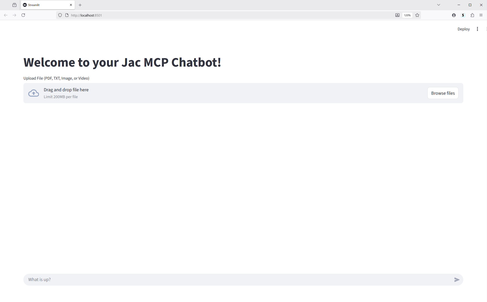

# 🎬 Video Narrator – AI-Powered Video Description Generator

[](https://www.jac-lang.org/)
[](https://www.python.org/)
[](https://platform.openai.com/)
[](https://streamlit.io/)
[](https://www.trychroma.com/)

---

## 🧠 Overview

**Video Narrator** is a Jac-based AI project that takes a **silent video** as input and automatically generates **spoken narration and textual descriptions** of what’s happening in the video.

It uses a combination of:
- 🧩 **Jac Language** for agent logic and multi-component orchestration (coordinate tasks between a **server**, **client**, and **AI model** ).
- ⚙️ **MCP (Model Context Protocol)** for server-client communication  
- 🎨 **Streamlit** for a clean, interactive UI  
- 🧠 **OpenAI (or Groq)** for language generation and narration synthesis, **Serper API** for contextual enrichment, and **ChromaDB** for vector-based memory of video scenes.

---

## 🗂️ Repository Structure

```

Generative-AI-Builds/
│── jac-projects/
│   ├── video-narrator/
│   │   ├── client.jac               # Streamlit UI definition
│   │   ├── server.jac               # Entry point for Jac backend
│   │   ├── server.impl.jac          # Implementation logic for video analysis and narration
│   │   ├── mcp_server.jac           # MCP server (runs on localhost:8899)
│   │   ├── mcp_client.jac           # MCP client for connecting to the server
│   │   ├── tools.jac                # Utility tools (e.g., model calling, audio generation)
│   │   ├── requirements.txt         # Python dependencies (auto-generated via pip freeze)
│   │   └── README.md  ← (this file) # Project documentation
│
│── .gitignore
│── README.md
│── LICENSE
│── jac-env/

````

---

## 🚀 Features

- 🎥 Upload a silent video and automatically generate a descriptive narration.
- 🗣️ AI-generated speech/audio from visual analysis.
- 🧠 Uses LLMs (OpenAI / Groq) for understanding scenes and generating descriptions.
- 💬 Web UI built with **Streamlit**.
- ⚡ Runs on Jac’s **MCP architecture** (client ↔ server communication).


---

## 🌐 Live Demo / Interface


> 🎥 Streamlit Interface Screenshot:  


---

## ⚙️ Environment Setup (Persistent Keys)

To make your environment variables **persistent** across sessions:
### For **macOS/Linux** (recommended):

1️⃣ Open your shell configuration file:
```bash
nano ~/.bashrc
# or on macOS
nano ~/.bash_profile
````

2️⃣ Add these lines:

```bash
export OPENAI_API_KEY="sk-..."
export SERPER_API_KEY="serper-key"
export MCP_SERVER_URL="http://localhost:8899/mcp"
```

3️⃣ Save and apply:

```bash
source ~/.bashrc
```

4️⃣ Verify:

```bash
echo $OPENAI_API_KEY
echo $SERPER_API_KEY
echo $MCP_SERVER_URL
```

---

## 🧩 Installation & Usage

### 1️⃣ Activate virtual environment

```bash
source ~/Generative-AI-Builds/jac-env/bin/activate
```

### 2️⃣ Navigate to the project directory

```bash
cd ~/Generative-AI-Builds/jac-projects/video-narrator
```

### 3️⃣ Install dependencies

```bash
pip install -r requirements.txt
```

### 4️⃣ 🧩 Running the Application

Open **3 terminals** (or use tmux):

#### 🖥️ Terminal 1 – Start MCP Server

```bash
jac run mcp_server.jac
```

> This starts the Jac backend on `http://127.0.0.1:8899`

---

#### ⚙️ Terminal 2 – Run Jac Server Logic

```bash
jac run server.jac
```

> Handles video processing, LLM calls, and narration generation.

---

#### 🌐 Terminal 3 – Start Streamlit UI

```bash
jac streamlit client.jac
```

> Then open the URL shown in the terminal (usually [http://localhost:8501](http://localhost:8501))

---

## 🧠 How It Works

1. User uploads a **silent video** through the Streamlit UI.
2. The video is sent to the **MCP server**, which extracts visual frames and analyzes them.
3. The **LLM** (OpenAI / Groq) generates a narration script.
4. The **audio engine** synthesizes the spoken narration.
5. Output: a narrated video or text transcript.

---

## 🧠 Core Files

| File               | Purpose                                          |
| ------------------ | ------------------------------------------------ |
| `server.jac`       | Defines backend server logic for AI narration    |
| `server.impl.jac`  | Implements server actions and connections        |
| `client.jac`       | Handles user requests and connects to MCP server |
| `mcp_server.jac`   | Starts the MCP-compatible API endpoint           |
| `mcp_client.jac`   | Client for sending commands to the MCP server    |
| `tools.jac`        | Helper modules and reusable AI tools             |
| `requirements.txt` | Python dependencies (Chroma, OpenAI, etc.)       |

---

## 🧪 Example Output

| Input                                | Output                                                                                         |
| ------------------------------------ | ---------------------------------------------------------------------------------------------- |
| Silent video of someone mixing paint | “A person is pouring red paint into a container and mixing it with a brush.” (Audio generated) |

---

## 🧱 Troubleshooting

| Issue                          | Fix                                                                                  |
| ------------------------------ | ------------------------------------------------------------------------------------ |
| `gio: Operation not supported` | Ignore — it just failed to auto-open browser.                                        |
| Tokens printing repeatedly     | Normal Jac authentication logs.                                                      |
| App not connecting to backend  | Ensure `MCP_SERVER_URL` matches the port your server is running on (default `8899`). |
| Module not found               | Reinstall dependencies with `pip install -r requirements.txt`.                       |

---

## 🔑 Environment Variables Summary

| Variable         | Description                                                  |
| ---------------- | ------------------------------------------------------------ |
| `OPENAI_API_KEY` | OpenAI or Groq API key for model generation                  |
| `SERPER_API_KEY` | Optional API key for Serper web search                       |
| `MCP_SERVER_URL` | The MCP server endpoint, default `http://localhost:8899/mcp` |

---

## 💡 Future Improvements

* Integrate video frame extraction & scene detection
* Generate synchronized audio narration output
* Add Streamlit-based upload & preview interface

---

## 🧑‍💻 Author

**Cavin Otieno Ouma**

🖥️ *MIS Developer & AI Enthusiast*

 📧 [cavin.otieno012@gmail.com](mailto:cavin.otieno012@gmail.com)
 🔗 [LinkedIn Profile](https://www.linkedin.com/in/cavin-otieno-9a841260/)
 📂 Project Repo: [Video Narrator on GitHub](https://github.com/OumaCavin/Generative-AI-Builds/tree/main/jac-projects/video-narrator)
 🌐 Main Repository: [Generative-AI-Builds](https://github.com/OumaCavin/Generative-AI-Builds.git)

---

## 🪪 License

This project is licensed under the **MIT License**.
See the [MIT License](https://choosealicense.com/licenses/mit/) file for details.

---

✨ *“Turning silent visuals into meaningful stories — powered by AI and Jac.”*

